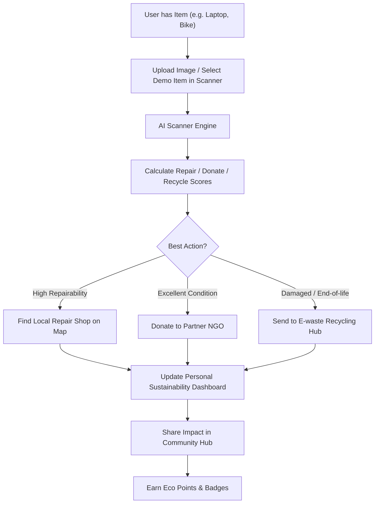

# SecondLife 🌍

[](https://github.com/melvindeepesh-boop/SECOND-LIFE/actions)
[](https://nextjs.org/)
[](https://react.dev/)
[](https://tailwindcss.com/)
[](https://threejs.org/)
[](LICENSE)

**SecondLife** is a premium, immersive, AI-powered Circular Economy Platform designed to help individuals, organizations, and recycling networks collaborate to repair, donate, upcycle, and recycle items. Built with an interactive 3D WebGL experience, it shifts users from a linear "take-make-waste" mindset to a circular lifecycle.

---

## 🚀 Key Pillars

1. **AI Item Scanner**  
   Intelligently analyze items (e.g., MacBook, Bicycle, Oak Chair) to determine their condition, repairability, donation score, and potential resale value. It estimates environmental offsets like carbon and water savings.
2. **Interactive 3D Globe**  
   An immersive, real-time particle-based Earth scene using React Three Fiber. Particles and orbiting debris represent various items flowing back into the economic loop instead of entering landfills.
3. **Circular Action Map**  
   Locate and connect with nearest NGOs, eco-conscious repair shops, and certified e-waste recycling depots near you.
4. **Impact Dashboard**  
   Visualize your contribution with metrics on total carbon offset (kg CO2), water saved (liters), and lives helped by your donations.
5. **Community Hub & Social Space**  
   Engage in eco-challenges, read upcycling success stories, view repair requests, and coordinate resource sharing through real-time communication boards.

---

## 🗺️ Circular Economy Flow

Below is how SecondLife takes an item and closes the waste loop:



---

## 🛠️ Tech Stack

- **Framework:** [Next.js 16](https://nextjs.org/) (App Router, Turbopack, TypeScript)
- **3D Graphics:** [React Three Fiber](https://r3f.docs.pmnd.rs/) & [Three.js](https://threejs.org/)
- **Styling:** [Tailwind CSS 4](https://tailwindcss.com/)
- **Animations:** [Framer Motion](https://www.framer.com/motion/) & [GSAP](https://gsap.com/)
- **Scrolling:** [Lenis Smooth Scroll](https://lenis.darkroom.engineering/)
- **Icons:** [Lucide React](https://lucide.dev/)

---

## 📂 Project Structure

```text
├── .github/
│   ├── ISSUE_TEMPLATE/     # Templates for bug reports and feature requests
│   └── workflows/
│       └── ci.yml          # Automated CI pipeline (lint, compile, build)
├── public/                 # Static assets
└── src/
    ├── app/
    │   ├── favicon.ico
    │   ├── globals.css     # Tailwind styling & glow animations
    │   ├── layout.tsx      # Main wrapper & Lenis smooth scroll provider
    │   └── page.tsx        # Main application page (Opening -> Main Content)
    └── components/         # Modular interactive UI & 3D elements
        ├── OpeningExperience.tsx  # Dynamic introductory entrance screen
        ├── Navbar.tsx             # Floating responsive glassmorphic navbar
        ├── HeroSection.tsx        # Title section with interactive actions
        ├── StatsSection.tsx       # Animated data counts
        ├── AIScanner.tsx          # Simulated AI item upload & analyzer
        ├── HowItWorks.tsx         # Circular step indicators
        ├── Comparison.tsx         # Linear vs. Circular economy charts
        ├── Stories.tsx            # Community success cards
        ├── Dashboard.tsx          # Sustainability impact metrics & graph
        ├── GlobalMap.tsx          # Map of local repair & donation centers
        ├── CommunityHub.tsx       # Local events & active repair requests
        ├── SocialHub.tsx          # Community messaging board & challenges
        ├── Contact.tsx            # Sustainability contact form
        ├── ThreeCanvas.tsx        # R3F WebGL Canvas (Orbiting particle globe)
        ├── SideNav.tsx            # Floating scroll progress dots indicator
        └── LenisProvider.tsx      # Scroll smoothing wrapper
```

---

## 💻 Local Setup & Installation

### Prerequisites
- Node.js (v20 or higher recommended)
- npm, yarn, or pnpm

### Steps
1. **Clone the repository:**
   ```bash
   git clone https://github.com/melvindeepesh-boop/SECOND-LIFE.git
   cd SECOND-LIFE
   ```
2. **Install dependencies:**
   ```bash
   npm install
   ```
3. **Run the development server:**
   ```bash
   npm run dev
   ```
   Open [http://localhost:3000](http://localhost:3000) in your browser to view the interactive 3D platform.
4. **Format & Lint checks:**
   ```bash
   npm run lint
   ```
5. **Compile production build:**
   ```bash
   npm run build
   ```

---

## 🤝 Contributing

Contributions are what make the open source community such an amazing place to learn, inspire, and create.
1. Fork the Project
2. Create your Feature Branch (`git checkout -b feature/AmazingFeature`)
3. Commit your Changes (`git commit -m 'feat: add some AmazingFeature'`)
4. Push to the Branch (`git push origin feature/AmazingFeature`)
5. Open a Pull Request

See [CONTRIBUTING.md](CONTRIBUTING.md) for more details.

---

## 📄 License

Distributed under the MIT License. See [LICENSE](LICENSE) for more information.
